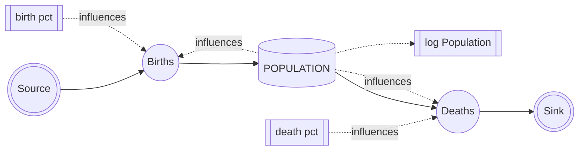
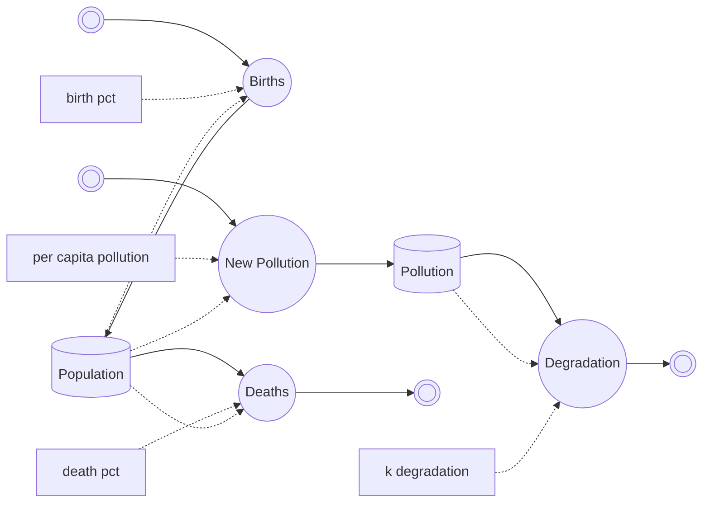
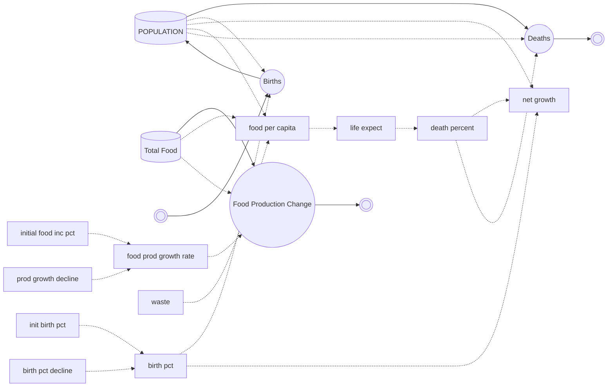
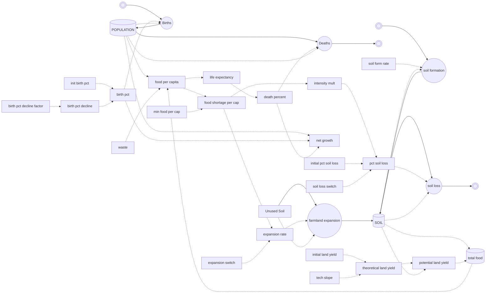

# Population, Food, And Systems Modeling

This report translates the provided population, pollution, food, and soil models
into game-design terms for OpenFront. The goal is not to simulate Earth. The goal
is to identify useful stock-flow structures, understand what extra inputs they
require, and reduce them back to the simplest readable game loop.

Implementation note: OpenFront's first game-native stock-flow pass now includes
population, resource production, food consumption, and war-pressure systems.
Food and famine parameters default to neutral values so existing balance stays
stable until sandbox tuning opts in.

One terminology note: the S-shaped population-over-time curve is **logistic**,
not logarithmic. A logarithm can be useful for plotting exponential growth, but
the bounded population model we are using is logistic:

```text
dN/dt = rN(1 - N / K)
```

## Modeling Vocabulary

- **Stock**: A quantity that persists over time, such as population, food,
  pollution, or soil.
- **Flow**: A rate that changes a stock, such as births, deaths, food
  production, food consumption, soil loss, or soil formation.
- **Converter / auxiliary variable**: A derived value that influences a flow,
  such as food per capita, death percent, farming intensity, or production
  growth rate.
- **Feedback loop**: A chain where the state of one stock changes a flow that
  later changes that same stock or another connected stock.
- **Delay**: A response that is not instant. Delays are where oscillations and
  boom-bust behavior usually appear.

For a game, these concepts are useful because they create mechanics that are
predictable locally but produce interesting strategic consequences globally.

## Reference Model: Births To Deaths



### Lesson

If birth and death percentages are constant, the net growth rate is constant.
When births exceed deaths, population grows exponentially. This is easy to
understand but unusable as a long-term game population model because it has no
resource limit.

### Game Application

The simple birth-death model is still valuable as the baseline:

```text
births = population * birthRate
deaths = population * deathRate
population += births - deaths
```

The current logistic model is a controlled extension of this. Instead of allowing
infinite growth, births are reduced as population approaches land-supported max
population:

```text
maxPopulation = tilesOwned * maxPopulationPerTile
births ~= r * population * (1 - population / maxPopulation)
```

This gives us the first simple control surface:

- `initialPopulation`
- `maxPopulationPerTile`
- `populationGrowthRate`
- `tilesOwned`

## Reference Model: Population With Pollution



### Lesson

Pollution is a second stock created by population and reduced by degradation.
Because pollution increases deaths, it creates delayed negative feedback.
Delayed feedback can produce oscillation: population rises, pollution builds,
deaths increase, population falls, pollution degrades, population recovers.

### Game Application

This pattern can represent any pressure stock:

- Pollution.
- Disease.
- Overcrowding.
- Unrest.
- Supply strain.
- War exhaustion.

The useful general form is:

```text
pressure += population * pressurePerCapita
pressure -= pressure * pressureDecayRate
deathRate += pressureDeathMultiplier * pressure
```

### Added Inputs

- Pressure generated per population per tick.
- Pressure decay rate.
- Pressure effect curve on deaths or productivity.
- Whether pressure is local to a nation, local to tiles, or global.

### Complexity Cost

This is where the game can start creating boom-bust cycles. That can be good if
it is legible, but it can also feel arbitrary if players cannot see the pressure
stock and understand how to reduce it.

For now, pollution-style pressure should be considered a later feature, not part
of the first food model.

## Reference Model: Population With Food



### Lesson

Food becomes the constraint between population and survival. Food per capita
drives life expectancy, and life expectancy drives death rate. Food production
can grow, but the growth rate itself can decline as the system approaches yield
limits.

### Game Application

For OpenFront, this is the most directly useful model.

Instead of treating food as only a carrying-capacity scalar, food should become a
stock that is produced, consumed, stored, and depleted:

```text
food += foodProduced
foodNeeded = population * foodPerPerson
foodConsumed = min(food, foodNeeded)
food -= foodConsumed
foodRatio = foodConsumed / foodNeeded
```

Then food availability can affect births and deaths:

```text
birthModifier = f(foodRatio)
deathModifier = g(foodRatio)
```

This makes food pressure readable:

- High food surplus means population can grow toward the land cap.
- Low food means birth rate falls and death rate rises.
- Stored food buffers temporary shocks.
- Conquest of productive land matters because it changes food production.

### Added Inputs

Minimum first-pass inputs:

- Food produced per tile per tick.
- Terrain food yield weights.
- Food consumed per population per tick.
- Food stockpile capacity.
- Food spoilage or waste rate.
- Birth rate under full food.
- Base death rate.
- Famine death rate when food is insufficient.
- Food ratio response curve.

Useful later inputs:

- Farming technology multiplier.
- Food waste.
- Trade/import efficiency.
- War damage to food production.
- Seasonal or biome-specific yield.

## Reference Model: Food, Soil, And Farming Technology



### Lesson

Food production is not just a function of people or land. It is limited by a
productive base: soil. Technology can increase theoretical yield, but soil can
set a hard ceiling. Food shortage can trigger intensification or farmland
expansion, which may solve a short-term problem while damaging the long-term
productive base.

### Game Application

This model suggests a richer agricultural system:

- Each tile has a soil fertility stock.
- Food production depends on terrain, fertility, and farming technology.
- Food shortages can push emergency farming intensity.
- Intensity increases food now but damages soil.
- Soil regenerates slowly.
- Farming technology increases yield without necessarily increasing soil loss.

This could create strong strategic mechanics:

- A high-tech smaller nation can feed more people on less land.
- Over-farming conquered land creates a future population crash.
- Scorched earth or nukes can damage fertility.
- Trade can spare a nation from destructive intensification.
- Farming technology becomes a non-military growth path.

### Added Inputs

- Soil fertility per tile.
- Soil formation/regeneration rate.
- Soil erosion rate.
- Farming intensity multiplier.
- Farming technology level.
- Farming technology growth rate or upgrade cost.
- Max theoretical yield from technology.
- Soil-limited yield curve.
- Farmland expansion rules.

### Complexity Cost

This is a much deeper game. It adds a hidden state per tile unless surfaced well.
It affects AI, UI, pathing priorities, conquest value, long-term balance, and
performance. It is attractive, but it should not be the first implementation of
food constraints.

## Feature Ideas For OpenFront

### Farming Technology

Farming technology could be a nation-level multiplier:

```text
foodProduced = baseFoodFromTiles * farmingTechnology
```

Possible control paths:

- Passive tech growth over time.
- Building-driven tech, such as Farms, Silos, Universities, or Factories.
- Resource investment to upgrade farming.
- Catch-up mechanics for smaller nations.

Gameplay value:

- Lets food pressure be solved by development, not only expansion.
- Gives tall play a way to compete with wide play.
- Creates meaningful civilian infrastructure targets.

Complexity:

- Requires UI for tech level and upgrade impact.
- Requires AI logic.
- Risks becoming a dominant strategy if military pressure cannot interrupt it.

### Waste And Distribution

Waste is a clean scalar for food inefficiency:

```text
usableFood = producedFood * (1 - wasteRate)
```

Gameplay value:

- Easy to understand.
- Useful as a balancing knob.
- Can represent logistics, corruption, spoilage, or wartime disruption.

Complexity:

- If waste is just a hidden multiplier, it may feel like a tax.
- Better if linked to visible infrastructure or trade disruption.

### Food Stockpiles

Food stockpiles let nations survive temporary shortages:

```text
foodStockpile = clamp(foodStockpile + produced - consumed, 0, foodCapacity)
```

Gameplay value:

- Makes food shortages gradual instead of instant.
- Gives raids, blockades, and lost farmland delayed consequences.
- Makes storage buildings meaningful.

Complexity:

- Requires clear HUD readouts.
- High storage can make food irrelevant if tuned too generously.

### Soil Fertility

Soil fertility is the long-term version of food production.

Gameplay value:

- Supports deep strategy and degradation/recovery.
- Makes land quality matter beyond raw tile count.

Complexity:

- Expensive conceptually and potentially technically.
- Hard to communicate unless map overlays and tooltips are excellent.
- Best reserved for a later iteration.

### Pollution / Disease / Crowding Pressure

This is the pollution model generalized into a negative-pressure stock.

Gameplay value:

- Adds consequences for extreme population density.
- Can prevent runaway mega-nations.
- Can create oscillations and recovery cycles.

Complexity:

- Easy to make frustrating.
- Requires visible pressure and clear mitigation.
- Should not be added until food is legible.

## Recommended Implementation Sequence

### Phase 1: Population And Food Only

Add food as an explicit stock and connect it to population births/deaths.

Use land as max population:

```text
maxPopulation = tilesOwned * maxPopulationPerTile
```

Use food as the short-term survival constraint:

```text
foodRatio = foodConsumed / foodNeeded
```

Do not add soil, pollution, farming tech, or farmland expansion yet.

### Phase 2: Food Production Detail

Split food production by terrain:

```text
foodProduced = plainsTiles * plainsFoodYield
             + highlandTiles * highlandFoodYield
             + mountainTiles * mountainFoodYield
```

Add waste and storage capacity.

### Phase 3: Farming Technology

Add a nation-level farming technology multiplier after the base loop is stable.

```text
foodProduced *= farmingTechnology
```

This is the first "development" feature worth considering because it creates a
simple non-expansion way to support more population.

### Phase 4: Soil / Long-Term Degradation

Only after food is readable and fun, add soil fertility as a deeper mechanic.
This should be treated as a separate initiative.

## Minimal Model We Need Now

The simplest useful tick loop is exactly:

1. New tick.
2. Produce food.
3. Feed people.
4. Store leftover food.
5. Adjust system state.
6. Some people are born.
7. Some people die.
8. Tick ends.

### Concrete Tick Formula

Inputs:

- `population`
- `food`
- `tilesOwned`
- `maxPopulationPerTile`
- `foodPerPersonPerTick`
- `foodProducedPerTilePerTick`
- `foodStorageCapacity`
- `populationGrowthRate`
- `baseDeathRate`
- `famineDeathRate`
- `wasteRate`

Derived:

```text
maxPopulation = tilesOwned * maxPopulationPerTile
foodProduced = tilesOwned * foodProducedPerTilePerTick * (1 - wasteRate)
foodNeeded = population * foodPerPersonPerTick
```

Tick:

```text
food += foodProduced

foodConsumed = min(food, foodNeeded)
food -= foodConsumed

foodRatio = foodNeeded <= 0 ? 1 : foodConsumed / foodNeeded
food = clamp(food, 0, foodStorageCapacity)

crowdingModifier = max(0, 1 - population / maxPopulation)
births = population * populationGrowthRate * crowdingModifier * foodRatio

faminePressure = 1 - foodRatio
deaths = population * (baseDeathRate + famineDeathRate * faminePressure)

population = max(0, population + births - deaths)
```

### Why This Is The Right First Food Model

- It preserves the current land-based max population idea.
- It makes food tangible instead of only a hidden carrying-capacity modifier.
- It creates surplus and shortage without adding soil or technology yet.
- It is easy to graph in the sandbox.
- It gives us clear knobs to tune before adding deeper systems.

### Sandbox Controls To Add First

- Food produced per tile per tick.
- Food consumed per person per tick.
- Food storage capacity per tile or fixed base storage.
- Waste rate.
- Base death rate.
- Famine death rate.
- Food shortage curve exponent.

### Sandbox Graphs To Add First

- Food stockpile over time.
- Food ratio over time.
- Births per tick over time.
- Deaths per tick over time.
- Population over time with food enabled.
- Sensitivity graph: food ratio -> birth/death modifier.

## Design Principle

The game should avoid hiding too many interacting constraints behind one number.
The first food model should be readable:

```text
land sets max population
food determines how fast population can grow and whether it declines
stockpiles buffer shocks
```

Everything else, including farming technology, soil, pollution, disease, and
farmland expansion, should be layered only after that loop is tuned and legible.
